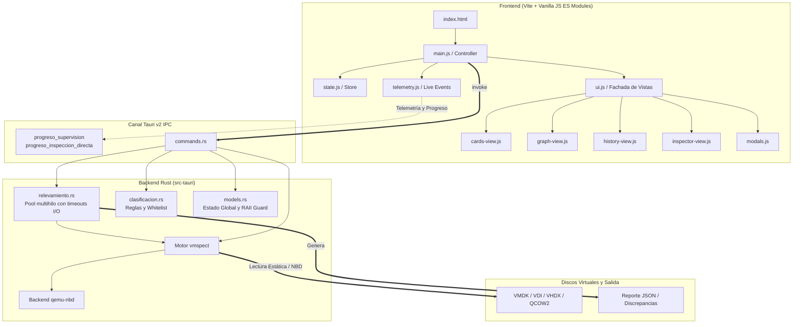

# VM Inventory 🖥️🔍

> **Auditoría, relevamiento masivo e inspección estática forense de máquinas virtuales.**

[](https://github.com/tu-usuario/vminventory/releases/tag/v2.0.0)
[](https://tauri.app/)
[](https://www.rust-lang.org/)
[](https://vitejs.dev/)
[](https://crates.io/crates/vmspect)
[](#)
[](#)

**VM Inventory** es una aplicación de escritorio de alto rendimiento construida con **Tauri v2** y **Rust**, diseñada para inspeccionar discos virtuales en reposo (sin encender las VMs), inventariar software instalado, clasificar aplicaciones automáticamente mediante reglas y auditar entornos de virtualización a gran escala mediante el motor estático `vmspect` y montaje NBD con `qemu-nbd`.

---

## ⚡ Características Principales

### 1. 📂 Relevador Masivo de VMs
- **Inspección sin encendido**: Analiza discos virtuales estáticamente utilizando el motor `vmspect` con soporte nativo y backend `qemu-nbd`.
- **Procesamiento paralelo multihilo**: Configura el número de hilos de trabajo según la CPU para acelerar escaneos en lotes de gran volumen.
- **Tolerancia a fallos y Timeouts de I/O**: Timeouts estrictos (máx. 5 segundos) en particiones inaccesibles y colmenas de registro (`Windows\System32\config`) para evitar bloqueos.
- **Telemetría y supervisión en tiempo real**:
  - Cronómetro autónomo de 1 segundo desacoplado de eventos del backend.
  - Barra de progreso continuo con interpolación y transiciones suaves (`transition: width 0.5s ease-in-out`).
  - Velocidad de procesamiento (VMs/min) y volumen procesado (GB).
  - Panel en vivo con estado de cada worker y flujo continuo de bitácora (*live logs*).
- **Reportes consolidados**: Genera bases de datos estructuradas en formato JSON y reportes automáticos de discrepancias.
- **Cancelación segura**: Control de interrupción inmediata con liberación de recursos mediante guardias RAII.

### 2. 🔎 Consultor y Analizador de Software
- **Búsqueda multicriterio instantánea**: Filtra por nombre de programa, máquina virtual, versión, propietario, sistema operativo, tipo de posesión y categoría.
- **Vistas dinámicas**:
  - **Tabla / Lista**: Visualización tabular detallada con ordenamiento y paginación.
  - **Tarjetas (*Cards View*)**: Vista modular interactiva con detalles expandibles.
  - **Gráficos e Indicadores (*Graph View*)**: Métricas visuales de distribución por SO, categorías más frecuentes y densidad de software.
- **Integración con el explorador**: Acceso directo con un clic a la carpeta física de la VM (`abrir_carpeta`).
- **Historial de auditorías**: Registro de relevamientos previos con recarga rápida de índices.

### 3. 🔬 Inspector Directo de Discos Virtuales
- **Análisis forense individual**: Inspecciona archivos de disco específicos (`.vmdk`, `.vdi`, `.vhdx`, `.qcow2`, `.raw`, `.img`).
- **Detección de particiones y sistemas de archivos**: MBR/GPT, particiones NTFS/FAT/EXT4, etiquetas de volumen, inicio y tamaño.
- **Extracción de metadatos del huésped**: Nombre de SO, edición, build, service pack, hostname, arquitectura y versión de herramientas de virtualización (*VM Tools*).
- **Exportación individual**: Exportación directa del informe de inspección a JSON.
- **Métricas de rendimiento**: Modo de acceso (nativo vs. NBD `qemu-nbd`), bytes leídos y duración en milisegundos.

### 4. 🏷️ Motor de Clasificación y Reglas Dinámicas (`rules.json`)
- **Configuración Externa Editable:** Los criterios de clasificación y patrones de filtrado están completamente desacoplados del código fuente en un archivo `rules.json` (o `rules.toml`).
- **Auto-generación al Iniciar:** Si el archivo no existe, la aplicación genera automáticamente la plantilla completa por defecto en `%APPDATA%\VMInventory\rules.json` (Windows) o `~/.config/vminventory/rules.json` (Linux/macOS).
- **Recarga Dinámica en Caliente:** Cualquier modificación manual en `rules.json` es aplicada inmediatamente en el siguiente relevamiento o inspección sin necesidad de reiniciar ni recompilar la aplicación.
- **Clasificación de Software Industrial:** Soporte preconfigurado para stacks de automatización y control (Siemens STEP 7 / TIA Portal / WinCC, Rockwell Studio 5000 / RSLogix / FactoryTalk, Schneider EcoStruxure / Citect, AVEVA InTouch, Omron, Mitsubishi, ABB, Beckhoff TwinCAT, Ignition SCADA, Emerson/GE iFIX, CODESYS, LabVIEW).
- **Exclusión Dinámica de Carpetas y Archivos:** Omitido de directorios de sistema (`System Volume Information`, `$RECYCLE.BIN`, `Temp`, `.git`, `node_modules`) y archivos temporales (`*.tmp`, `*.pagefile`, `*.sys`, `*.iso`).
- **Simulador Interactivo Integrado:** Modal gráfico para evaluar cadenas de software, ejecutables y proveedores contra las reglas activas.

---

## 🏗️ Arquitectura del Sistema



---

## 📁 Estructura del Repositorio

```
vminventory/
├── public/                  # Archivos estáticos (favicon, iconos)
├── src/                     # Código fuente del Frontend
│   ├── assets/              # Recursos estáticos empaquetados por Vite
│   ├── js/                  # Módulos ES organizados por responsabilidad
│   │   ├── main.js          # Punto de entrada y orquestador de eventos
│   │   ├── state.js         # Estado global del cliente y configuraciones
│   │   ├── ui.js            # Fachada y control de interfaz de usuario
│   │   ├── consultor-controller.js # Lógica de filtrado y búsqueda
│   │   ├── cards-view.js    # Renderizado de tarjetas de resultados
│   │   ├── graph-view.js    # Visualización gráfica de métricas
│   │   ├── history-view.js  # Vista del historial de relevamientos
│   │   ├── history.js       # Persistencia local del historial
│   │   ├── inspector-view.js# Vista del inspector forense de discos
│   │   ├── modals.js        # Modales de configuración, reglas y diagnóstico
│   │   ├── telemetry.js     # Manejo de métricas y stream en vivo
│   │   ├── theme.js         # Selector de tema (claro/oscuro/sistema)
│   │   └── utils.js         # Funciones utilitarias y formateadores
│   └── styles/              # Hojas de estilo
│       └── app.css          # Estilos principales de la aplicación
├── src-tauri/               # Código fuente del Backend (Rust / Tauri v2)
│   ├── capabilities/        # Definición de permisos y seguridad
│   │   └── default.json     # Capacidades del core y plugins
│   ├── icons/               # Iconos de la aplicación en múltiples resoluciones
│   ├── src/                 # Código Rust
│   │   ├── clasificacion.rs # Lógica de categorización de software y reglas
│   │   ├── commands.rs      # Comandos invocables desde el Frontend (IPC)
│   │   ├── lib.rs           # Configuración del builder de Tauri y setup
│   │   ├── main.rs          # Entrada binaria de la aplicación
│   │   ├── models.rs        # Estructuras de datos, DTOs y AppState
│   │   └── relevamiento.rs  # Orquestador del escaneo masivo multihilo
│   ├── Cargo.toml           # Dependencias y metadatos de Rust
│   └── tauri.conf.json      # Configuración de Tauri (ventanas, CSP, bundle)
├── index.html               # Documento principal HTML5
├── package.json             # Dependencias de Node.js y scripts
├── vite.config.js           # Configuración de Vite (puerto 5173, HMR)
├── .gitignore               # Configuración de exclusiones de Git
├── RELEASE_NOTES.md         # Notas de lanzamiento y hashes SHA-256
└── README.md                # Documentación del proyecto
```

---

## 🚀 Requisitos y Configuración

### Prerrequisitos

- **Node.js**: `>= 18.0.0`
- **Rust Toolchain**: `>= 1.77.2` ([rustup.rs](https://rustup.rs/))
- **C++ Build Tools** (en Windows: Visual Studio C++ Build Tools) o dependencias nativas de Linux (`libwebkit2gtk-4.1`, `build-essential`, `curl`, `wget`, `file`, `libssl-dev`, `libgtk-3-dev`, `libayatana-appindicator3-dev`, `librsvg2-dev`).
- **QEMU NBD (`qemu-nbd`)**: Requerido para soporte completo de discos virtuales complejos.
  - **Windows**: Ubicación estándar en `C:\Program Files\qemu\qemu-nbd.exe` (detectada automáticamente) o mediante la variable de entorno `QEMU_NBD`.
  - **Linux / macOS**: Instalable mediante el gestor de paquetes (`apt install qemu-utils` o `brew install qemu`).

### Instalación

1. Clonar el repositorio:
   ```bash
   git clone https://github.com/tu-usuario/vminventory.git
   cd vminventory
   ```

2. Instalar dependencias del frontend:
   ```bash
   npm install
   ```

---

## ⚙️ Configuración y Reglas Externas (`rules.json`)

**VM Inventory** utiliza un documento de configuración externo (`rules.json`) para determinar qué carpetas/archivos omitir durante el escaneo y cómo clasificar el software detectado en las máquinas virtuales.

### 📍 Ubicación del Archivo

El motor de reglas busca el archivo en el siguiente orden de prioridad:

1. **Ruta personalizada:** Especificada por el usuario en el modal de *Ajustes del Analizador* (`Ruta Personalizada de Reglas`).
2. **Directorio de la aplicación / ejecución:** `./rules.json` o `./rules.toml` junto al binario ejecutable o directorio de trabajo.
3. **Directorio de datos del usuario (predeterminado):**
   - **Windows:** `%APPDATA%\VMInventory\rules.json` (ej. `C:\Users\<Usuario>\AppData\Roaming\VMInventory\rules.json`).
   - **Linux / macOS:** `~/.config/vminventory/rules.json` o `$XDG_CONFIG_HOME/vminventory/rules.json`.

> 💡 **Generación Automática:** Si el archivo no existe al iniciar la aplicación, **VM Inventory** lo crea automáticamente con la plantilla por defecto lista para producción.

---

### 🧩 Estructura del Archivo `rules.json`

El archivo consta de 5 secciones principales:

```json
{
  "$schema": "https://vminventory.dev/schemas/rules.v2.json",
  "version": "2.0.0",
  "exclusions": {
    "folders": [
      "System Volume Information",
      "$RECYCLE.BIN",
      "Temp",
      ".git",
      "node_modules"
    ],
    "files": [
      "*.tmp",
      "*.temp",
      "*.pagefile",
      "*.sys",
      "*.log",
      "*.iso"
    ]
  },
  "classifications": [
    {
      "vendor": "Siemens",
      "software": "SIMATIC STEP 7",
      "patterns": ["s7dbg.exe", "*Step7*", "*Simatic*", "Step 7*"],
      "category": "Automatización Industrial",
      "tags": ["plc", "siemens", "step7", "industrial"]
    },
    {
      "vendor": "Rockwell Automation",
      "software": "Studio 5000 Logix Designer",
      "patterns": ["*Studio 5000*", "*Studio 5K*", "*LogixDesigner*", "LogixDesigner.exe"],
      "category": "Automatización Industrial",
      "tags": ["plc", "rockwell", "allen-bradley", "studio5000"]
    }
  ],
  "whitelist": [
    {
      "nombre": "microsoft office",
      "editor": "Microsoft",
      "motivo": "Suite ofimática corporativa estándar."
    }
  ],
  "noise": [
    {
      "nombre": "redistributable",
      "motivo": "Componente redistribuible de runtime (VC++)."
    }
  ],
  "categories": [
    {
      "nombre": "Navegadores",
      "patrones": ["chrome", "firefox", "microsoft edge"],
      "tags": ["navegador", "internet"]
    }
  ]
}
```

### 🔍 Tipos de Patrones Soportados

Las reglas de patrones (`patterns`, `patrones`, `exclusions.folders`, `exclusions.files`) admiten:

- **Comodines Glob:** `*` (cualquier secuencia de caracteres) y `?` (un solo caracter). Ej: `*Step7*`, `*.tmp`, `*LogixDesigner*`.
- **Expresiones Regulares (RegEx):** Patrones que comiencen con `^`, terminen en `$` o usen sintaxis regex estándar. Ej: `^s7.*\.exe$`.
- **Nombres de Ejecutables y Rutas:** Coincidencia exacta o por subcadena sobre ejecutables y nombres de software.
- **Límites de Palabra:** Coincidencias alfanuméricas directas preservando palabras completas (evitando falsos positivos como `git` en `Logitech`).

---

## 🛠️ Comandos de Desarrollo y Verificación

| Comando | Descripción |
| :--- | :--- |
| `npm run tauri dev` | Inicia la aplicación completa en modo desarrollo (Vite + backend Rust con HMR y DevTools). |
| `npm run dev` | Inicia únicamente el servidor de desarrollo web de Vite (`http://localhost:5173`). |
| `npm run build` | Compila los assets del frontend en la carpeta `dist/`. |
| `npm test` | Ejecuta la suite de pruebas unitarias y de integración frontend. |
| `npm run test:rust` | Ejecuta todas las pruebas unitarias y de integración del backend Rust. |
| `npm run tauri build` | Genera el instalador y binario de producción optimizado (`.exe` / `.msi`). |

---

## 📦 Formatos de Disco Soportados

Gracias a la integración con el motor `vmspect` y `qemu-nbd`:

- **VMware**: `.vmdk` (monolítico, sparse, flat, split).
- **VirtualBox**: `.vdi`.
- **Microsoft Hyper-V / Virtual PC**: `.vhd`, `.vhdx`.
- **QEMU / KVM**: `.qcow2`, `.qcow`.
- **Imágenes directas**: `.raw`, `.img`.

---

## 📝 Changelog

### [v2.0.0] - 2026-09-07 (Engine & UI Refactor)
- **Migración Integral a `qemu-nbd`:** Eliminación de dependencias residuales de `qemu-img`; migración completa al backend NBD de alto rendimiento en `vmspect`.
- **Resolución y Validación Automática de Binario:** Detección predeterminada de `C:\Program Files\qemu\qemu-nbd.exe`, validación de versión con bandera `--version` y supresión de consolas emergentes en Windows.
- **Optimización de I/O y Timeouts Estrictos:** Inclusión de límites de tiempo de 5 segundos en lecturas bloqueantes de particiones NTFS/FAT y colmenas de registro `Windows\System32\config`.
- **Cronómetro Autónomo (1s):** Temporizador desacoplado de la telemetría del backend con actualización continua cada 1000 ms y resincronización de drift.
- **Barra de Progreso Continuo:** Transiciones visuales suaves con CSS (`transition: width 0.5s ease-in-out`) para eliminar saltos bruscos.

---

## 🤝 Contribución

Las contribuciones son bienvenidas. Si deseas colaborar:

1. Realiza un Fork del repositorio.
2. Crea una rama para tu función (`git checkout -b feature/nueva-funcionalidad`).
3. Realiza tus cambios y genera el commit respetando las convenciones del proyecto.
4. Envía un Pull Request detallando los cambios introducidos.

---

## ⚖️ Licencia

Distribuido bajo la Licencia MIT. Consulta `LICENSE` para más detalles.
