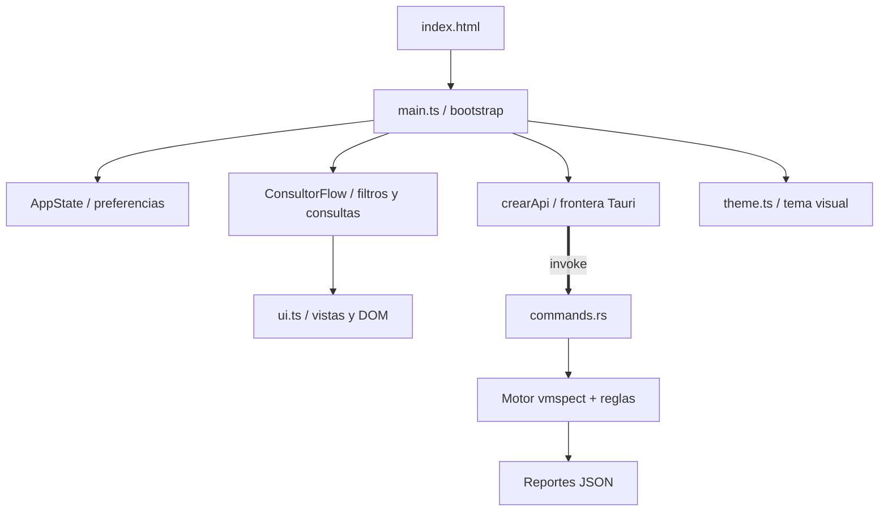

# VM Inventory 🖥️🔍

> **Auditoría, relevamiento masivo e inspección estática forense de máquinas virtuales.**

[](https://github.com/jcostasuarez/vminventory/releases/tag/v3.2.0)
[](https://tauri.app/)
[](https://www.rust-lang.org/)
[](https://vitejs.dev/)
[](https://crates.io/crates/vmspect)
[](#)
[](#)

**VM Inventory** es una aplicación de escritorio de alto rendimiento construida con **Tauri v2** y **Rust**, diseñada para inspeccionar discos virtuales en reposo (sin encender las VMs), inventariar software instalado, clasificar aplicaciones automáticamente mediante reglas y auditar entornos de virtualización a gran escala mediante el motor estático `vmspect` y montaje NBD con `qemu-nbd`.

---

## ⚡ Características Principales

### 1. 📂 Relevador Masivo de VMs
- **Inspección sin encendido**: Analiza discos virtuales estáticamente utilizando el motor `vmspect` con soporte nativo y backend `qemu-nbd`.
- **Procesamiento paralelo acotado**: Inicia los lotes con dos workers y solo aumenta la concurrencia mediante una selección explícita.
- **Tolerancia a fallos**: `vmspect` informa advertencias y conserva resultados parciales sin abortar todo el relevamiento.
- **Telemetría y supervisión por snapshots**:
  - El frontend consulta `inspection_progress` cada 400 ms, sin callbacks ni eventos Tauri desde los workers.
  - Barra de progreso continuo con interpolación y transiciones suaves (`transition: width 0.5s ease-in-out`).
  - Velocidad estimada (VMs/min) y volumen procesado derivados de las tareas y bytes publicados por el motor.
  - `vmspect 0.8.0` publica snapshots atómicos de progreso agregado; no expone el detalle por worker ni una bitácora incremental.
- **Reportes consolidados**: Genera bases de datos estructuradas en formato JSON y reportes automáticos de discrepancias.
- **Cancelación segura**: Un token compartido permite detener la operación preservando los resultados ya procesados y sin iniciar nuevas imágenes pendientes.

### 2. 🔎 Consultor y Analizador de Software
- **Búsqueda multicriterio instantánea**: Filtra por nombre de programa, máquina virtual, versión, propietario, sistema operativo, tipo de posesión y categoría.
- **Vistas dinámicas**:
  - **Tabla / Lista**: Visualización tabular detallada con ordenamiento y paginación.
  - **Tarjetas (*Cards View*)**: Vista modular interactiva con detalles expandibles.
  - **Gráficos e Indicadores (*Graph View*)**: Métricas visuales de distribución por SO, categorías más frecuentes y densidad de software.

- **Historial de auditorías**: Registro de relevamientos previos con recarga rápida de índices.

### 3. 🔬 Inspector Directo de Discos Virtuales
- **Análisis forense individual**: Inspecciona archivos de disco específicos (`.vmdk`, `.vdi`, `.vhdx`, `.qcow2`, `.raw`, `.img`).
- **Detección de particiones y sistemas de archivos**: MBR/GPT, particiones NTFS/FAT/EXT4, etiquetas de volumen, inicio y tamaño.
- **Extracción de metadatos del huésped**: Nombre de SO, edición, build, service pack y versión de herramientas de virtualización (*VM Tools*).
- **Exportación individual**: Exportación directa del informe de inspección a JSON.
- **Métricas de rendimiento**: Modo de acceso (nativo vs. NBD `qemu-nbd`), bytes leídos y duración en milisegundos.

### 4. 🏷️ Motor de Clasificación y Reglas Dinámicas (`rules.json`)
- **Configuración Externa Editable:** Los criterios de clasificación y patrones de filtrado están completamente desacoplados del código fuente en un archivo `rules.json` (o `rules.toml`).
- **Auto-generación al Iniciar:** Si el archivo no existe, la aplicación genera automáticamente la plantilla completa por defecto en `%APPDATA%\VMInventory\rules.json` (Windows) o `~/.config/vminventory/rules.json` (Linux/macOS).
- **Recarga Dinámica en Caliente:** Cualquier modificación manual en `rules.json` es aplicada inmediatamente en el siguiente relevamiento o inspección sin necesidad de reiniciar ni recompilar la aplicación.
- **Clasificación de Software Industrial:** Soporte preconfigurado para stacks de automatización y control (Siemens STEP 7 / TIA Portal / WinCC, Rockwell Studio 5000 / RSLogix / FactoryTalk, Schneider EcoStruxure / Citect, AVEVA InTouch, Omron, Mitsubishi, ABB, Beckhoff TwinCAT, Ignition SCADA, Emerson/GE iFIX, CODESYS, LabVIEW).
- **Exclusión Dinámica de Carpetas y Archivos:** Omitido de directorios de sistema (`System Volume Information`, `$RECYCLE.BIN`, `Temp`, `.git`, `node_modules`) y archivos temporales (`*.tmp`, `*.pagefile`, `*.sys`, `*.iso`).
- **Simulador Interactivo Integrado:** Modal gráfico para evaluar cadenas de software, ejecutables y proveedores contra las reglas activas.

---

## 🧰 Herramientas de la aplicación

La interfaz expone nuevamente las tres herramientas principales:

- **Analizador:** recibe un directorio de origen, busca recursivamente imágenes de máquinas virtuales con `vmspect` y genera la base de datos JSON en el destino indicado. Incluye progreso, workers, cancelación y configuración del motor.
- **Consultor:** consulta los reportes JSON generados y permite filtrar por programa, versión, máquina virtual, tipo y responsable.
- **Reporte:** inspecciona una única imagen de disco o reporte JSON y muestra metadatos de imagen, sistema operativo, particiones y software detectado; también permite exportar el informe.

En el Consultor, los tipos no se configuran manualmente: cada subcarpeta directa y legible de la carpeta de inventario se convierte en un tipo, incluso si está vacía. Los archivos y los JSON en la raíz se omiten; las carpetas inaccesibles también se omiten, y los nombres duplicados que solo difieren en mayúsculas/minúsculas se consolidan. Al recargar, el tipo se vuelve a calcular desde la ubicación actual del reporte, por lo que un reporte cuya carpeta fue eliminada deja de aparecer sin modificar su JSON.

La versión se muestra en la barra de estado. El frontend la obtiene desde `CARGO_PKG_VERSION` (la versión de `src-tauri/Cargo.toml`) tanto en el comando Tauri como en el fallback de Vite, por lo que no es necesario mantener otro número de versión en la interfaz.

---

## 🏗️ Arquitectura del Sistema



---

## 🔧 Progreso de relevamientos para desarrolladores

El relevamiento masivo no utiliza la API antigua de callbacks para telemetría.
Al iniciar `procesar_relevamiento`, `AppState` crea y conserva un `Arc` del
`InspectionEngine` configurado para ese lote. El trabajo bloqueante llama a
`inspect_batch` sobre esa misma instancia y el comando `inspection_progress`
consulta `engine.progress().snapshot()`.

El DTO IPC contiene exactamente los campos disponibles en `vmspect 0.8.0`:
`completed_tasks`, `total_tasks`, `percentage`, `stage_id`, `bytes_processed`,
`total_bytes` y `cancelled`. Esta versión identifica la etapa con `stage_id`,
no con texto ni detalle por VM; la interfaz adapta esos campos y usa valores
neutros cuando el motor no publica datos equivalentes.

La inspección individual de la pantalla Reporte publica su propio
`InspectionEngine` antes de iniciar el trabajo bloqueante y reutiliza el mismo
comando `inspection_progress`. El frontend consulta el snapshot cada 250 ms,
normaliza porcentajes numéricos o textuales y detiene el polling al llegar a
`100`, ante cancelación, error definitivo o desmontaje de la vista.

La cancelación se solicita con `detener_inspeccion`, que marca el token
compartido y llama a `InspectionEngine::cancel()` para reflejarla también en el
snapshot. El polling se limpia al terminar el comando, mientras que
`BatchResult` y su resumen derivado son siempre la fuente de verdad final para
reportes, errores por imagen y resultados parciales.

---

## 📁 Estructura del Repositorio

```
vminventory/
├── public/                  # Archivos estáticos (favicon, iconos)
├── src/                     # Código fuente del Frontend
│   ├── assets/              # Recursos estáticos empaquetados por Vite
│   ├── js/
│   │   ├── main.ts         # Bootstrap, estado, IPC y flujo principal
│   │   ├── types.ts        # Contratos TypeScript para DOM, IPC y dominio
│   │   ├── ui.ts           # Composición de vistas y referencias DOM
│   │   └── theme.ts        # Tema claro/oscuro
│   └── styles/
│       └── app.css         # Estilos de la aplicación
├── src-tauri/               # Código fuente del Backend (Rust / Tauri v2)
│   ├── capabilities/        # Definición de permisos y seguridad
│   │   └── default.json     # Capacidades del core y plugins
│   ├── icons/               # Iconos de la aplicación en múltiples resoluciones
│   ├── src/                 # Código Rust
│   │   ├── clasificacion.rs # Lógica de categorización de software y reglas
│   │   ├── commands.rs      # Frontera IPC y adaptación de respuestas
│   │   ├── consultor.rs      # Consulta de reportes JSON persistidos
│   │   ├── lib.rs           # Configuración del builder de Tauri y setup
│   │   ├── main.rs          # Entrada binaria de la aplicación
│   │   ├── models.rs        # DTOs IPC y estado mínimo
│   │   ├── relevamiento.rs  # Descubrimiento y escaneo masivo multihilo
│   │   └── vmspect_backend.rs # Integración única con vmspect
│   ├── Cargo.toml           # Dependencias y metadatos de Rust
│   └── tauri.conf.json      # Configuración de Tauri (ventanas, CSP, bundle)
├── index.html               # Documento principal HTML5
├── package.json             # Dependencias de Node.js y scripts
├── vite.config.ts           # Configuración de Vite (puerto 5173, HMR)
├── tsconfig.json            # Configuración y validación de TypeScript
├── .gitignore               # Configuración de exclusiones de Git
├── RELEASE_NOTES.md         # Notas de lanzamiento y hashes SHA-256
└── README.md                # Documentación del proyecto
```

---

## 🎯 Decisión del Frontend

El frontend usa **TypeScript modular + CSS** sobre Vite. Para esta aplicación sigue siendo la opción más simple: Tauri aporta la ventana nativa y el IPC, mientras que las vistas son principalmente formularios, tablas, tarjetas y progreso.

No se incorpora React, Vue ni Tailwind por ahora. TypeScript aporta tipos para el estado, el DOM y los contratos IPC sin añadir una capa de componentes innecesaria. La frontera con Tauri está centralizada en `crearApi` dentro de `src/js/main.ts`, y `npm run typecheck` valida el frontend antes del build.

---

## 🚀 Requisitos y Configuración

### Prerrequisitos

- **Node.js**: `>= 18.0.0`
- **Rust Toolchain**: `>= 1.77.2` ([rustup.rs](https://rustup.rs/))
- **C++ Build Tools** (en Windows: Visual Studio C++ Build Tools) o dependencias nativas de Linux (`libwebkit2gtk-4.1`, `build-essential`, `curl`, `wget`, `file`, `libssl-dev`, `libgtk-3-dev`, `libayatana-appindicator3-dev`, `librsvg2-dev`).
- **QEMU NBD (`qemu-nbd`)**: Requerido para soporte completo de discos virtuales complejos. La aplicación no ejecuta ni valida este binario: `vmspect` se encarga de resolverlo y lanzarlo únicamente cuando la inspección lo necesita.
  - **Windows**: Instalable desde QEMU; `vmspect` busca la ubicación estándar, `QEMU_NBD` o el PATH.
  - **Linux / macOS**: Instalable mediante el gestor de paquetes (`apt install qemu-utils` o `brew install qemu`).

### Instalación

1. Clonar el repositorio:
   ```bash
   git clone https://github.com/tu-usuario/vminventory.git
   cd vminventory
   ```

2. Instalar dependencias del frontend:
   ```bash
   npm install
   ```

3. Validar tipos y pruebas del frontend:
   ```bash
   npm run typecheck
   npm test
   ```

---

## ⚙️ Configuración y Reglas Externas (`rules.json`)

**VM Inventory** utiliza un documento de configuración externo (`rules.json`) para determinar qué carpetas/archivos omitir durante el escaneo y cómo clasificar el software detectado en las máquinas virtuales.

### 📍 Ubicación del Archivo

El motor de reglas busca el archivo en el siguiente orden de prioridad:

1. **Ruta personalizada:** Especificada por el usuario en el modal de *Ajustes del Analizador* (`Ruta Personalizada de Reglas`).
2. **Directorio de la aplicación / ejecución:** `./rules.json` o `./rules.toml` junto al binario ejecutable o directorio de trabajo.
3. **Directorio de datos del usuario (predeterminado):**
   - **Windows:** `%APPDATA%\VMInventory\rules.json` (ej. `C:\Users\<Usuario>\AppData\Roaming\VMInventory\rules.json`).
   - **Linux / macOS:** `~/.config/vminventory/rules.json` o `$XDG_CONFIG_HOME/vminventory/rules.json`.

> 💡 **Generación Automática:** Si el archivo no existe al iniciar la aplicación, **VM Inventory** lo crea automáticamente con la plantilla por defecto lista para producción.

---

### 🧩 Estructura del Archivo `rules.json`

El archivo consta de 5 secciones principales:

```json
{
  "$schema": "https://vminventory.dev/schemas/rules.v2.json",
  "version": "2.0.0",
  "exclusions": {
    "folders": [
      "System Volume Information",
      "$RECYCLE.BIN",
      "Temp",
      ".git",
      "node_modules"
    ],
    "files": [
      "*.tmp",
      "*.temp",
      "*.pagefile",
      "*.sys",
      "*.log",
      "*.iso"
    ]
  },
  "classifications": [
    {
      "vendor": "Siemens",
      "software": "SIMATIC STEP 7",
      "patterns": ["s7dbg.exe", "*Step7*", "*Simatic*", "Step 7*"],
      "category": "Automatización Industrial",
      "tags": ["plc", "siemens", "step7", "industrial"]
    },
    {
      "vendor": "Rockwell Automation",
      "software": "Studio 5000 Logix Designer",
      "patterns": ["*Studio 5000*", "*Studio 5K*", "*LogixDesigner*", "LogixDesigner.exe"],
      "category": "Automatización Industrial",
      "tags": ["plc", "rockwell", "allen-bradley", "studio5000"]
    }
  ],
  "whitelist": [
    {
      "nombre": "microsoft office",
      "editor": "Microsoft",
      "motivo": "Suite ofimática corporativa estándar."
    }
  ],
  "noise": [
    {
      "nombre": "redistributable",
      "motivo": "Componente redistribuible de runtime (VC++)."
    }
  ],
  "categories": [
    {
      "nombre": "Navegadores",
      "patrones": ["chrome", "firefox", "microsoft edge"],
      "tags": ["navegador", "internet"]
    }
  ]
}
```

### 🔍 Tipos de Patrones Soportados

Las reglas de patrones (`patterns`, `patrones`, `exclusions.folders`, `exclusions.files`) admiten:

- **Comodines Glob:** `*` (cualquier secuencia de caracteres) y `?` (un solo caracter). Ej: `*Step7*`, `*.tmp`, `*LogixDesigner*`.
- **Expresiones Regulares (RegEx):** Patrones que comiencen con `^`, terminen en `$` o usen sintaxis regex estándar. Ej: `^s7.*\.exe$`.
- **Nombres de Ejecutables y Rutas:** Coincidencia exacta o por subcadena sobre ejecutables y nombres de software.
- **Límites de Palabra:** Coincidencias alfanuméricas directas preservando palabras completas (evitando falsos positivos como `git` en `Logitech`).

---

## 🛠️ Comandos de Desarrollo y Verificación

| Comando | Descripción |
| :--- | :--- |
| `npm run tauri dev` | Inicia la aplicación completa en modo desarrollo (Vite + backend Rust con HMR y DevTools). |
| `npm run dev` | Inicia únicamente el servidor de desarrollo web de Vite (`http://localhost:5173`). |
| `npm run build` | Compila los assets del frontend en la carpeta `dist/`. |
| `npm test` | Ejecuta las suites de contrato frontend y backend. |
| `npm run test:rust` | Ejecuta todas las pruebas unitarias y de integración del backend Rust. |
| `npm run tauri build` | Genera el instalador y binario de producción optimizado (`.exe` / `.msi`). |

---

## 📦 Formatos de Disco Soportados

Gracias a la integración con el motor `vmspect` y `qemu-nbd`:

- **VMware**: `.vmdk` (monolítico, sparse, flat, split).
- **VirtualBox**: `.vdi`.
- **Microsoft Hyper-V / Virtual PC**: `.vhd`, `.vhdx`.
- **QEMU / KVM**: `.qcow2`, `.qcow`.
- **Imágenes directas**: `.raw`, `.img`.

---

## 📝 Changelog

### [v3.2.0] - 2026-09-11 (Progreso por snapshots y Consultor dinámico)
- **Motor actualizado:** VM Inventory utiliza `vmspect v0.8.0`, con snapshots atómicos de progreso para relevamientos e inspecciones individuales.
- **Progreso y cancelación:** el Analizador y el Reporte consultan el progreso publicado por el motor, limpian el polling al finalizar y conservan resultados parciales al cancelar.
- **Clasificación eficiente:** los patrones se compilan una sola vez, con diagnósticos para expresiones inválidas y coincidencia de respaldo.
- **Consultor dinámico:** los tipos se derivan de subcarpetas legibles del inventario, con filtros por versión, tipo y responsable, sugerencias y agrupación de resultados.
- **Configuración avanzada:** se incorporan reglas, modo dump, colmena SYSTEM, discrepancias, workers, backend de disco y opciones de seguimiento en un único panel.
- **Accesibilidad y UX:** se añaden roles ARIA, navegación por teclado, estados vivos, filtros activos y una presentación revisada para Analizador, Consultor y Reporte.
- **Verificación:** typecheck, contratos frontend/backend, formato Rust y build Vite verificados antes del empaquetado.

### [v3.1.0] - 2026-09-08 (Rediseño del Analizador y actualización de vmspect)
- **Motor actualizado:** VM Inventory utiliza `vmspect v0.5.0`, con diagnóstico diferenciado para `qemu-nbd` ausente y componentes VMDK faltantes.
- **Flujo del Analizador rediseñado:** la configuración de entrada y la salida con telemetría se organizan en dos fases persistentes, con diseño responsive para ventanas más estrechas.
- **Telemetría accesible:** los controles interactivos usan elementos semánticos, regiones vivas y barras de progreso con valores ARIA para facilitar la supervisión del relevamiento.
- **Bitácora progresiva:** el registro técnico se presenta como un panel desplegable que se abre durante la ejecución o ante errores y se repliega al finalizar correctamente.
- **Diagnóstico de discos:** los errores de extents, padres y descriptores VMDK faltantes se preservan como componentes de disco ausentes, sin clasificarlos erróneamente como ausencia de `qemu-nbd`.
- **Verificación:** TypeScript, contratos frontend/backend, formato Rust y build Vite verificados antes del empaquetado.

### [v3.0.0] - 2026-09-08 (Delegación completa de qemu-nbd)
- **Cambio rompedor:** se eliminan el comando Tauri `validar_binario_qemu`, el método frontend `validarQemu` y los controles de validación manual de `qemu-nbd`.
- **Responsabilidad centralizada:** `vmspect` resuelve, valida y ejecuta `qemu-nbd` durante la inspección; VM Inventory solo transmite la configuración explícita y el indicador de backend.
- **Diagnóstico simplificado:** el diagnóstico de la aplicación ya no afirma disponibilidad de `qemu-nbd` fuera de una inspección real.
- **Verificación:** TypeScript, contratos frontend/backend, formato Rust y build Vite verificados antes del empaquetado.

### [v2.3.1] - 2026-09-08 (Actualización de vmspect)
- **Dependencia actualizada:** Se fija el motor `vmspect` en `v0.4.2` para incorporar la versión solicitada sin cambios en el contrato de VM Inventory.
- **Mantenimiento de release:** Se sincronizan las versiones de Cargo, Tauri y npm para el parche `v2.3.1`.

### [v2.3.0] - 2026-09-08 (Descubrimiento y concurrencia con vmspect)
- **Descubrimiento delegado a `vmspect`:** Se utiliza `vmspect::list_vms` para recorrer recursivamente las imágenes y filtrar extents secundarios sin mantener un segundo walker en la aplicación.
- **Procesamiento concurrente centralizado:** `vmspect::ConcurrentProcessor` y `InspectionEngine` gestionan la cola de inspecciones, los límites de workers y la cancelación compartida.
- **Telemetría integrada:** El progreso de cada inspección, los tiempos y los fallos por imagen se traducen al contrato de supervisión existente sin descartar el resto del lote.
- **Adaptación de informes:** Los `InspectionReport` se convierten al inventario JSON existente, conservando exclusiones, clasificación, discrepancias y metadatos de la aplicación.
- **Validación:** TypeScript, contratos frontend/backend y formato Rust verificados antes del empaquetado.

### [v2.2.0] - 2026-09-08 (TypeScript Frontend & Backend Contracts)
- **Migración del frontend a TypeScript:** Se reemplaza el conjunto de módulos JavaScript por una entrada tipada y módulos de estado, UI, tema y contratos IPC.
- **Contratos de integración verificables:** Se incorporan typecheck y pruebas de contrato para la frontera frontend/Tauri, selección de archivos, persistencia de configuración y consultas.
- **Backend desacoplado:** La integración con `vmspect` se concentra en `vmspect_backend.rs`, se reutiliza el runtime asíncrono de Tauri y se simplifica la gestión de cancelación.
- **Inspector y flujo de herramientas revisados:** Analizador, Consultor y Reporte comparten una API tipada; la versión mostrada se obtiene desde `CARGO_PKG_VERSION`.
- **Pruebas backend portables:** Los contratos Rust cubren reglas, normalización del consultor, cancelación y lectura de reportes JSON sintéticos sin depender de una máquina virtual real.

### [v2.0.0] - 2026-09-07 (Engine & UI Refactor)
- **Migración Integral a `qemu-nbd`:** Eliminación de dependencias residuales de `qemu-img`; migración completa al backend NBD de alto rendimiento en `vmspect`.
- **Delegación completa del backend NBD:** La resolución, validación operativa y ejecución de `qemu-nbd` quedan en `vmspect`; la capa Tauri solo traduce opciones y consume el informe.
- **Integración centralizada del motor:** La inspección y la cancelación se delegan al motor `vmspect`, sin hilos ni polling duplicados en la capa Tauri.
- **Cronómetro Autónomo (1s):** Temporizador desacoplado de la telemetría del backend con actualización continua cada 1000 ms y resincronización de drift.
- **Barra de Progreso Continuo:** Transiciones visuales suaves con CSS (`transition: width 0.5s ease-in-out`) para eliminar saltos bruscos.

---

## 🤝 Contribución

Las contribuciones son bienvenidas. Si deseas colaborar:

1. Realiza un Fork del repositorio.
2. Crea una rama para tu función (`git checkout -b feature/nueva-funcionalidad`).
3. Realiza tus cambios y genera el commit respetando las convenciones del proyecto.
4. Envía un Pull Request detallando los cambios introducidos.

---

## ⚖️ Licencia

Distribuido bajo la Licencia MIT. Consulta `LICENSE` para más detalles.
