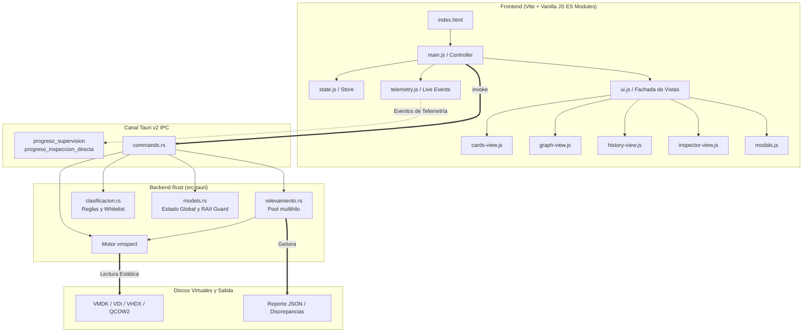

# VM Inventory 🖥️🔍

> **Auditoría, relevamiento masivo e inspección estática forense de máquinas virtuales.**

[](https://tauri.app/)
[](https://www.rust-lang.org/)
[](https://vitejs.dev/)
[](https://crates.io/crates/vmspect)
[](#)

**VM Inventory** es una aplicación de escritorio de alto rendimiento construida con **Tauri v2** y **Rust**, diseñada para inspeccionar discos virtuales en reposo (sin necesidad de encender las VMs), inventariar software instalado, clasificar aplicaciones automáticamente mediante reglas y auditar entornos de virtualización a gran escala.

---

## ⚡ Características Principales

### 1. 📂 Relevador Masivo de VMs
- **Inspección sin encendido**: Analiza discos virtuales estáticamente utilizando el motor `vmspect`.
- **Procesamiento paralelo multihilo**: Configura el número de hilos de trabajo según la CPU para acelerar escaneos en lotes de gran volumen.
- **Telemetría y supervisión en tiempo real**:
  - Progreso global y por VM individual.
  - Estimación de tiempo transcurrido y restante.
  - Velocidad de procesamiento (VMs/min) y volumen procesado (GB).
  - Panel en vivo con estado de cada worker y flujo continuo de bitácora (*live logs*).
- **Reportes consolidados**: Genera bases de datos estructuradas en formato JSON y reportes automáticos de discrepancias.
- **Cancelación segura**: Control de interrupción inmediata con liberación de recursos mediante guardias RAII.

### 2. 🔎 Consultor y Analizador de Software
- **Búsqueda multicriterio instantánea**: Filtra por nombre de programa, máquina virtual, versión, propietario, sistema operativo, tipo de posesión y categoría.
- **Vistas dinámicas**:
  - **Tabla / Lista**: Visualización tabular detallada con ordenamiento y paginación.
  - **Tarjetas (*Cards View*)**: Vista modular interactiva con detalles expandibles.
  - **Gráficos e Indicadores (*Graph View*)**: Métricas visuales de distribución por SO, categorías más frecuentes y densidad de software.
- **Integración con el explorador**: Acceso directo con un clic a la carpeta física de la VM (`abrir_carpeta`).
- **Historial de auditorías**: Registro de relevamientos previos con recarga rápida de índices.

### 3. 🔬 Inspector Directo de Discos Virtuales
- **Análisis forense individual**: Inspecciona archivos de disco específicos (`.vmdk`, `.vdi`, `.vhdx`, `.qcow2`, `.raw`, `.img`).
- **Detección de particiones y sistemas de archivos**: MBR/GPT, etiquetas de volumen, inicio y tamaño.
- **Extracción de metadatos del huésped**: Nombre de SO, edición, build, service pack, hostname, arquitectura y versión de herramientas de virtualización (*VM Tools*).
- **Exportación individual**: Exportación directa del informe de inspección a JSON.
- **Métricas de rendimiento**: Modo de acceso (nativo vs. fallback QEMU), bytes leídos y duración en milisegundos.

### 4. 🏷️ Motor de Clasificación y Reglas
- **Clasificación inteligente**: Enriquecimiento automático de programas con categorías (*Desarrollo, Base de Datos, Sistema, Utilidades, etc.*) y etiquetas (*tags*).
- **Filtrado de ruido**: Reglas de lista blanca (*whitelist*) para excluir componentes internos de sistema y actualizaciones menores.
- **Validador y simulador integrado**: Modal interactivo para probar cadenas de software contra las reglas activas.

---

## 🏗️ Arquitectura del Sistema



---

## 📁 Estructura del Repositorio

```
vminventory/
├── public/                  # Archivos estáticos (favicon, iconos)
├── src/                     # Código fuente del Frontend
│   ├── assets/              # Recursos estáticos empaquetados por Vite
│   ├── js/                  # Módulos ES organizados por responsabilidad
│   │   ├── main.js          # Punto de entrada y orquestador de eventos
│   │   ├── state.js         # Estado global del cliente y configuraciones
│   │   ├── ui.js            # Fachada y control de interfaz de usuario
│   │   ├── consultor-controller.js # Lógica de filtrado y búsqueda
│   │   ├── cards-view.js    # Renderizado de tarjetas de resultados
│   │   ├── graph-view.js    # Visualización gráfica de métricas
│   │   ├── history-view.js  # Vista del historial de relevamientos
│   │   ├── history.js       # Persistencia local del historial
│   │   ├── inspector-view.js# Vista del inspector forense de discos
│   │   ├── modals.js        # Modales de configuración, reglas y diagnóstico
│   │   ├── telemetry.js     # Manejo de métricas y stream en vivo
│   │   ├── theme.js         # Selector de tema (claro/oscuro/sistema)
│   │   └── utils.js         # Funciones utilitarias y formateadores
│   └── styles/              # Hojas de estilo
│       ├── app.css          # Estilos principales de la aplicación
│       └── shadcn.css       # Variables de diseño y componentes
├── src-tauri/               # Código fuente del Backend (Rust / Tauri v2)
│   ├── capabilities/        # Definición de permisos y seguridad
│   │   └── default.json     # Capacidades del core y plugins
│   ├── icons/               # Iconos de la aplicación en múltiples resoluciones
│   ├── src/                 # Código Rust
│   │   ├── clasificacion.rs # Lógica de categorización de software y reglas
│   │   ├── commands.rs      # Comandos invocables desde el Frontend (IPC)
│   │   ├── lib.rs           # Configuración del builder de Tauri y setup
│   │   ├── main.rs          # Entrada binaria de la aplicación
│   │   ├── models.rs        # Estructuras de datos, DTOs y AppState
│   │   └── relevamiento.rs  # Orquestador del escaneo masivo multihilo
│   ├── Cargo.toml           # Dependencias y metadatos de Rust
│   └── tauri.conf.json      # Configuración de Tauri (ventanas, CSP, bundle)
├── index.html               # Documento principal HTML5
├── package.json             # Dependencias de Node.js y scripts
├── vite.config.js           # Configuración de Vite (puerto 5173, HMR)
├── .gitignore               # Configuración de exclusiones de Git
└── README.md                # Documentación del proyecto
```

---

## 🚀 Requisitos y Configuración

### Prerrequisitos

- **Node.js**: `>= 18.0.0`
- **npm** o **pnpm**
- **Rust Toolchain**: `>= 1.77.2` ([rustup.rs](https://rustup.rs/))
- **C++ Build Tools** (en Windows: Visual Studio C++ Build Tools) o dependencias nativas de Linux (`libwebkit2gtk-4.1`, `build-essential`, `curl`, `wget`, `file`, `libssl-dev`, `libgtk-3-dev`, `libayatana-appindicator3-dev`, `librsvg2-dev`).
- *(Opcional)* **QEMU Tools (`qemu-img`)**: Recomendado para soporte extendido de formatos de disco complejos o no estándar.

### Instalación

1. Clonar el repositorio:
   ```bash
   git clone https://github.com/tu-usuario/vminventory.git
   cd vminventory
   ```

2. Instalar dependencias del frontend:
   ```bash
   npm install
   ```

---

## 🛠️ Comandos de Desarrollo

| Comando | Descripción |
| :--- | :--- |
| `npm run tauri dev` | Inicia la aplicación completa en modo desarrollo (Vite + backend Rust con HMR y DevTools). |
| `npm run dev` | Inicia únicamente el servidor de desarrollo web de Vite (`http://localhost:5173`). |
| `npm run build` | Compila los assets del frontend en la carpeta `dist/`. |
| `npm run preview` | Previsualiza la compilación del frontend localmente. |
| `npm run tauri build` | Genera el instalador y binario de producción optimizado. |

---

## 📦 Formatos de Disco Soportados

Gracias a la integración con el motor `vmspect`, VM Inventory es compatible con una amplia variedad de formatos de almacenamiento virtual:

- **VMware**: `.vmdk` (monolítico, sparse, flat, split).
- **VirtualBox**: `.vdi`.
- **Microsoft Hyper-V / Virtual PC**: `.vhd`, `.vhdx`.
- **QEMU / KVM**: `.qcow2`, `.qcow`.
- **Imágenes directas**: `.raw`, `.img`.

---

## 📄 Estructura del Reporte JSON

Al completar un relevamiento, se produce un archivo JSON estructurado con el siguiente formato:

```json
{
  "metadatos": {
    "aplicacion": "VM Inventory",
    "fecha_relevamiento": "2026-09-07T12:00:00Z",
    "ruta_origen": "/ruta/a/vms",
    "duracion_formateada": "00:04:12",
    "total_vms": 42,
    "vms_exitosas": 40,
    "vms_con_observaciones": 2,
    "vms_discrepantes": 0,
    "vms_fallidas": 0,
    "total_programas": 1280,
    "peso_total_gb": 350.5,
    "cancelado": false
  },
  "vms": [
    {
      "exitosa": true,
      "nombre_vm": "SRV-PROD-APP01",
      "nombre_interno": "srv-prod-app01",
      "ruta_carpeta": "/ruta/a/vms/SRV-PROD-APP01",
      "propietario": "Infraestructura",
      "tipo_posesion": "Corporativa",
      "elemento_asignado": "Servidor",
      "sistema_operativo": "Windows Server 2019 Standard",
      "hipervisor": "VMware ESXi",
      "peso_gb": 45.2,
      "discrepante": false,
      "observaciones": [],
      "fecha_relevamiento": "2026-09-07T12:01:30Z",
      "programas": [
        {
          "nombre": "PostgreSQL 14",
          "version": "14.5-1",
          "editor": "PostgreSQL Global Development Group",
          "categoria": "Base de Datos",
          "tags": ["database", "sql"],
          "relevante": true
        }
      ]
    }
  ]
}
```

---

## 🤝 Contribución

Las contribuciones son bienvenidas. Si deseas colaborar:

1. Realiza un Fork del repositorio.
2. Crea una rama para tu función (`git checkout -b feature/nueva-funcionalidad`).
3. Realiza tus cambios y genera el commit respetando las convenciones del proyecto.
4. Envía un Pull Request detallando los cambios introducidos.

---

## ⚖️ Licencia

Distribuido bajo la Licencia MIT. Consulta `LICENSE` para más detalles.
